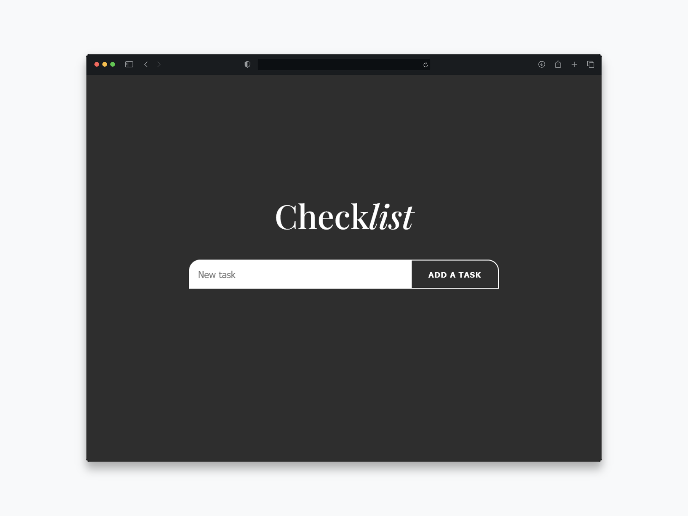

## [ENGLISH VERSION]

### 🎯 Learning Goals

This project was developed to:

- **Strengthen core skills** in HTML, CSS, and JavaScript.

- **Understand and implement** local data storage using localStorage.

- **Apply DOM manipulation** and event handling concepts.

- **Organize a web project** with clarity and maintainability.

### ⚙️ Features

- **Add tasks:** Enter a task using an input field and add it to the list.

- **Delete tasks:** Remove individual tasks from the list.

- **Task counter:** Dynamically display the number of pending tasks.

- **Data persistence:** Automatically saves tasks in the browser using localStorage.

- **Responsive design:** Adapts smoothly to various screen sizes.

### Live preview

- View the project live : [Live preview](https://marioncts.github.io/to-do-list/)

## [VERSION FRANÇAISE]

### 🎯 Objectifs d'apprentissage

Ce projet a été développé pour :

- **Renforcer mes compétences de base** en HTML, CSS, et JavaScript.

- **Comprendre et mettre en oeuvre** le stockage local des données avec localStorage.

- **Appliquer les notions de manipulation du DOM** et de gestion des évènements.

- **Organiser un projet web** de manière claire et maintenable.

### ⚙️ Fonctionnalités

- **Ajouter des tâches :** Saisir une tâche via un champ de saisie et l'ajouter à la liste.

- **Supprimer des tâches :** Retirer des tâches individuellement de la liste.

- **Compteur de tâches :** Afficher dynamiquement le nombre de tâches en attente.

- **Persistence des données :** Sauvegarde automatique des tâches dans le navigateur grâce à localStorage.

- **Design responsive :** S'adapte parfaitement à différentes tailles d'écrans.

### Aperçu en direct

- Testez le projet en ligne : [Voir le projet](https://marioncts.github.io/to-do-list/)

### Screenshot

